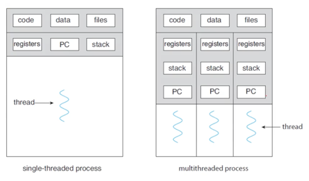
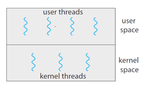

## 쓰레드의 이해
- a process was an executing program with a single thread of control
  - 프로세스는 흐름이 하나 뿐이다.
- however, a process is able to contain multiple threads of control, isn't it?
  - 하지만, 프로세스는 여러 개의 thread of control을 가질 수 있다.

그래서 쓰레드는,
- a lightweight process(LWP)
- a basic unit of CPU utilization
  - CPU 입장에서 가장 작은 단위가 프로세스가 아니라 스레드가 된다.
- comprises a thread ID, a program counter, a register set, and a stack.
  - 이제 pid(프로세스 id) 대신 tid(쓰레드 id)가 해당 CPU를 점령한다. (한 프로세스안에 여러 개의 쓰레드가 있을 때) 
  - PC(프로그램 카운터), 레지스터, 스택또한 쓰레드 별로 달라지게 된다.

멀티쓰레드 상태에선 위 처럼 PC,register,stack을 각 `쓰레드`단위로 갖는다.

## 멀티 쓰레딩의 장점
- Responsiveness : may allow continued execution
  - 유저 인터페이스같은 작업을 처리할 때 blocking 되어있을 필요없이, non-blocking 형태로 execution을 계속할 수 있다.
- Resource Sharing : threads share resources of process
  - 쓰레드는 위의 그림처럼 코드영역과 데이터영역을 공유한다. 따라서, IPC에서 다루었던 shared-memory or message-passing 같은 방식보다 편하게 자원을 공유할 수 있다.
- Economy : cheaper than process creation
  - 하나의 프로세스를 하나 더 만드는게 아닌, 프로세스 내에 여러 개의 쓰레드를 만드므로 훨씬 더 경제적이다.
  - context swithing 과 thread switching 중에도 후자가 더 간단하다.
- Scalability : process can take advantage of multiprocessor architectures
  - 멀티프로세서 아키텍쳐같은 병렬처리가 가능하기 떄문에 확정성이 좋다.

## 멀티 쓰레딩 모델
user thread와 kernel thread. 두 타입의 쓰레드가 존재한다.

### User threads are
- supported above the kernel, and are manged `without kernel support`
  - 커널 위에서(커널 없이) 유저모드 안에서 쓰레딩을 하는 방식.

### Kernel threads are
- supported and managed directly ny the `operating system`
  - 운영체제가 직접 다루는 쓰레드.

### Three relationships between user and kernel threads
- Many-to-One Model (커널1, 유저n)
- Ont-to-One Model (커널1, 유저1)
- Many-to-Many Model (커널n, 유저n)

## Implicit Threading

### alternative approaches using implicit threading
- Thread Pools
  - create a number of threads in a pool where they await work
  - 여러 개의 쓰레드들을 쓰레드 풀에 넣어두고, 어떤 쓰레드가 필요하면 그 쓰레드를 쓰레드풀에서 가져온다. 
- OpenMP
  - a set of compiler directives and an API for programs written in C/C++
  - 라이브러리가 아닌 컴파일러에 지시어를 주어서 처리
  - 