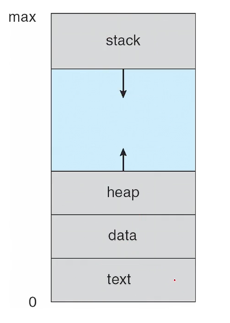
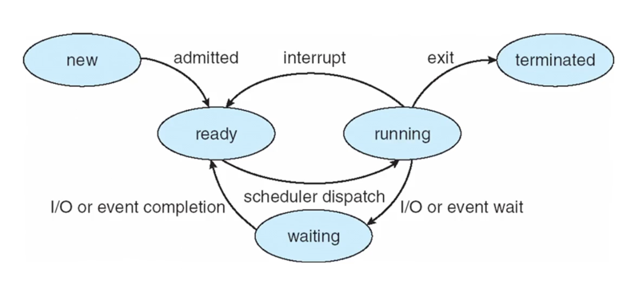
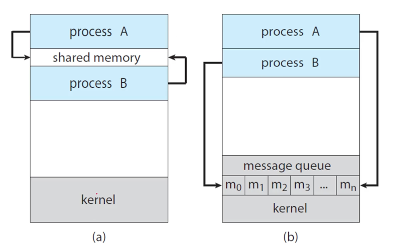

## 프로세스의 이해
프로세스의 정의는 실행중인 프로그램이고,
OS는 이 프로그램들을 실행시켜주는 일을 한다.(= OS의 작업의 단위=프로세스)

하나의 프로세스가 실행되기 위해선 자원들이 필요하다.
- CPU time
- memory
- files
- and I/O devices

### 프로세스의 메모리 layout은 아래와 같은 섹션들로 나누어진다.

- Text section
    - the executable code (명령어들)
- Data section
    - global variables (전역변수들)
- Heap section
    - memory that is dynamically allocated during program run time (힙 영역, 메모리 할당)
- Stack section
    - temporary data storage when invoking functions (스택 영역, 호출된 함수들이 쌓이는)
    - such as function parameters, return addresses and local variables (파라미터, 반환 주소, 지역 변수)


### 프로세스의 생명주기
프로세스의 생명주기는 5개의 상태를 가진다.
- new : the process is being created (막 프로세스가 생성된 상태)
- running : Instructions are being executed (프로세스의 명령어를 cpu에 명령해 실행시킨 상태)
- waiting : the process is waiting for some event to occur. (다른 프로세스가 cpu를 점유할 동안 기다리는 상태)
- ready : the process is waiting to be assigned to a processor. (대기하다가 cpu를 점령하기 전에 ready queue에서 대기하는 상태)
- terminated : the process has finished execution. (모든 과정이 끝나 종료된 상태)



- (new) fork() 시스템 콜을 통해 새로운 프로세스 하나 만들어달라고 OS에게 요청
- (waiting) 초기화 및 승인이 끝난 후 cpu를 획득하기 위해 ready 상태가 됨. (ready queue안에 들어가 있음)
- (running) cpu scheduling 통해 운영체제가 해당 프로세스에게 cpu를 줌.
    - (ready) running 상태에서 작업하다가 스스로 cpu를 너무 많이 쓴다고 감지하거나, OS가 interrupt를 주면 ready로 가서 대기
    - (waiting) 또는 running 도중 I/O 나 event wait가 있을 때 자발적으로 waiting queue에 들어가서 대기함
        - I/O or event wait가 끝나면 ready상태로 돌아감
- (terminated) running 도중 exit 및 return 하면 terminated 상태가 된다.
- OS가 프로세스로부터 메모리, 자원 등등을 회수한다.


### 프로세스를 관리하는 방법
PCB(Process Control Block)을 사용한다.
PCB라는 구조체에 프로세스의 모든 정보들을 저장함 (TCB[Task Control Block])이라고 부르기도 한다.

PCB가 가지고 있는 정보는 아래와 같다.
- 프로세스의 상태 : new / running / waiting / ready / terminated
- program counter(PC)
    - 다음에 실행될 명령어를 갖는다.
- CPU registers
    - PC나 CPU 레지스터를 문맥(context)라고 부른다.
- CPU-scheduling information : cpu를 주거나 release하기 위해 필요한 정보들
- Memory-management information : 메모리 할당 정보들
- Accounting information : 계정정보
- I/O status information : 어떤 파일 open했고 또 lock을 걸어 놨는지에 대한 정보

각 프로세스 마다 PCB가 존재하므로, OS가 PCB를 관리해주어야 한다.

### 스레드 & 프로세스
프로세스는 기본적으로 single thread of execution을 가진다.
> Single Thread Execution 패턴은 공통의 오브젝트에 대해 다수의 Thread가 작업을 할 때, 동시에 작업을 하는 것이 아니라 `한 번에 하나`의 Thread가 대상 오브젝트를 사용할 수 있도록 하는 패턴입니다.

프로세스 안에서 single thread execution으로는 부족하다.
하나의 프로세스 내에서도 여러개의 작업이 동시에 실행되게 만들고 싶어서 `Thread`가 등장.
(위의 single thread fo execution의 스레드와 혼동x)

Thread는
- 하나의 프로세스에서도 여러 가지의 작업을 동시에 할 수 있다.
- 따라서, 프로세스를 여러개 두는거 보다 스레드를 여러개 두는 것이 장점이 많다.

그래서 지금은 멀티 프로세싱이 아닌 멀티 스레딩이 대세이다.

### 멀티 프로세싱
멀티 프로세싱의 목적은 동시에 여러개의 프로세스를 실행시키는 것이다.
그 이유는,
- so as to maximize CPU utilization
    - CPU 사용효율을 극대화하기 위해서

#### time sharing
멀티프로세싱에서 time sharing을 하는이유는,
- 프로세스간에 자주 switching을 하여,
- 사용자 입장에서 각 프로그램이 동시에 실행되고 있는 것 처럼 만든다.
    - 실제론 동시에 도는 거 아님.

#### 스케쥴링 큐(FIFO)
time sharing을 하기 위해선 스케쥴링 큐를 통해 cpu를 스케쥴링 해줘야 함.
스케쥴링이란 수행 가능한 여러 프로세스들 중에서 하나의 프로세스를 선택하는 것이다.

- cpu는 하나기 때문에 cpu를 점유하는 프로세스외의 여러개의 프로세스는 앞에서 대기해야함(ready queue)
- running 상태에서 바로 레디 큐로 가거나 웨이팅 큐에 간다.


#### Context Switch
문맥(Context)는 하나의 PCB라고 생각하면 된다.

IO 인터럽트가 발생하면
현재 문맥을 저장하고, 쉬었다가 다시 시작할 때 저장된 부분부터 진행한다.

- 현재 프로세스의 문맥을 저장하고
- 새로운 프로세스의 문맥을 보관한다.


프로세스를 만들 수 있음.
부모 프로세스, 자식 프로세스
실행할 때
- 부모와 자식이 동시에 실행됨 (execute concurrently)
- 자식이 실행되는 동안 부모가 기다림 (wait)


## 프로세스의 생성
새로운 프로세스는 fork()에 의해 생성된다.

자식 프로세스는 현재 부모의 메모리 주소 공간을 복사한다.

return 0 이면 자식 프로세스이고, 운영체제가 부여한 pid를 리턴하면 부모 프로세스라는 걸 구분할 수 있다.

```C
int main() {
    pid_t pid;
    pid = fork();
    printf("pid: " , pid);
}
```
위를 실행하면, parent 프로세스가 먼저 본인의 pid를 출력할 것이고, 그 다음 child 프로세스가 0을 출력할 것이다.

- fork()는?
  fork()를 실행하면 부모 프로세스의 address space를 그대로 복제한다.

그 후, 자식 프로세스가 run 하는 동안 wait()하여 child process 가 terminate해 인터럽트를 걸때 까지 wait queue에서 기다린다.

그러면 부모 프로세스는 남은 작업들을 계속 수행(execute)한다.

```C
int main() {
    pid_t pid;
    pid = fork();
    if(pid > 0) // parent process
      wait(NULL);
    printf("pid: " , pid);
}
```
그래서 wait를 한 경우엔, child 프로세스가 먼저 0을 출력하고 parent 프로세스가 그 후에 본인의 pid를 출력하게 된다.

```C
int value = 5;

int main() {
    pid_t pid;
    pid = fork();
    
    if(pid == 0) { // child process
      value += 15;
      return 0;
    }
    
    else if(pid > 0) // parent process
      wait(NULL);
    printf("pid: " , pid);
}
```
위의 경우는 어떻게 될까?
- fork()하여 부모 프로세스의 address space 복제
- 현재 부모 프로세스이므로 else if 블록에 진입(pid>0이므로)
- wait하여 자식 프로세스 시작
- 자식 프로세스에서 value+=15 수행
- 자식 프로세스 terminate 하여 부모 프로세스가 남은 작업 실행(printf)

이 때 20이 출력될 것이란 예상과 다르게 5가 출력된다.
이는, fork()시점에 부모 프로세스의 value까지 복사하기 때문에, 부모와 자식의 value 변수는 공용으로 쓰는게 아닌 각자 사용한다는 것을 알 수 있다.
-> child에서 변경되는 건 parent에 영향을 미치지 못한다.

```C
int main() {
  fork();
  fork();
  fork();
  
  return 0;
}
```

위의 경우엔 몇개의 프로세스가 생성된 걸까?
- 첫 fork에선
    - P0이 fork 하여 P1을 만든다
- 그 다음 fork에선
    - P0이 P2를 만들고, P1이 P3를 만든다
- 세번째 fork 에선
    - P0이 P4를 만들고, P2가 P5를 만든다
    - P1이 P6을 만들고, P3이 P7을 만든다

따라서 총 8개의 프로세스가 생성되는 것이다.
이것을 보면 fork()를 실행하면 부모 자식 관계없이 모두 그의 자식 프로세스를 만든다는 것을 알 수 있다.


## 프로세스간 통신
지금까지 프로세스가 concurrently(동시에)하게 실행되는 것을 알아보았다.
- concurrently하게 실행되는 방식의 종류는 두가지 존재한다.
    - independent processes
        - 데이터 공유x
        - 서로 메세지 주고받을 일x
    - cooperating process
        - 프로세스 서로 영향을 주고받음(메세지 주고받음, 데이터 공유)

### IPC
IPC(Inter-Process Communication) 가 cooperating process에서 발생한다.

IPC 메커니즘?
- that is, `send` data to and `receive` data from each other
    - 데이터를 교환하게 해줌

IPC엔 두가지 모델이 존재한다.
- shared memory
    - 공유 메모리를 사용해 데이터를 주고받음
- message passing
    - 메세지를 주고받음
    - 복잡한 일련의 과정들을 운영체제에 맡김



### Producer-Consumer Problem (생산자-소비자 문제)
- cooperating processes간의 가장 기본적인 문제
- A producer produces information that is consumed by a consumer
    - "생산자는 정보를 생산하고 소비자는 정보를 소비한다."
- 생산하는 속도와 소비하는 속도의 차이에 의해 발생
    - 소비하는 속도가 더 빠르면 생산된 데이터는 바로 소비되지 못한다.

#### A solution using shared-memory (shared-memory 방식으로 문제를 해결)
- 생산자와 소비자가 동시에 동작한다. (To allow producer and consumer to run concurrently)
- 중간에 버퍼를 사용하여
    - 생산자는 버퍼에 보내고 싶은 정보를 채우고
    - 소비자는 버퍼에서 가져간다.

- 메모리 영역을 공유하게 되면
    - 프로그래머들이 이곳에 접근하는 것을 구현해줘야한다.
- 그럼 번거로우니 message-passing방법을 사용 (운영체제가 해줌)

#### A solution using message-Passing (message-Passing 방식으로 문제를 해결)
- OS가 cooperating processes들에게 api를 제공함(shared memory관련 작업을 os가 해줌)
- 메세지를 send, receive로 이루어진다. 나머지 작업은 OS가 해주기 때문.

그래서 communication link를 통해 두 프로세스가 message passing을 할 수 있게 해주면 된다.
#### direct or indirect communication
- direct
    - 프로세스 P가 프로세스 Q에게 바로 전달
        - 누가 주고 누가 받는지 명시한다.
        - send(P,message), receive(Q,message)
        - 그럼 communication link가 자동으로 생성된다.(누가 누구에게 주는지 알기 때문에)
        - P와 Q 사이에 한 개만 존재한다.

- indirect
    - P가 매개체에 전달하고, 그 매개체에서 Q에게 전달
    - 매개체 = port(=mailbox) 에 전달하여 전달하고 전달받음
    - send(A,message) , receive(A,message) -> A에 전달하고 A에서 가져감
    - 두개의 프로세스가 포트를 공유할 때 링크가 생성됨(자동 생성되는게 아님)
    - 이 링크는 두 개 이상의 프로세스가 사용할 수 있다.
    - OS가 해주는 일
        - 이 프로세스가 사용할 새로운 mailbox를 만들어주면 된다.
        - mailbox를 통해 보내고 받게 해준다.
        - mailbox를 지워줌

#### synchronous(blocking) and asynchronous(non blocking) communication
- Blocking send : the sender is blocked until the message is received
    - 메세지를 받을 때 까지 block 된 상태
- Non blocking send : the sender is sends the message and continue
    - 메세지 보내고 계속 하던 일함
- Blocking receive : the receiver blocks until a message is available
    - 메세지 받을 때 까지 기다림
- Non Blockin receive : the receiver retrieves either a valid message or a null message
    - receiver가 메세지를 못받았거나 valid한 메세지를 받으면 null message를 리턴
