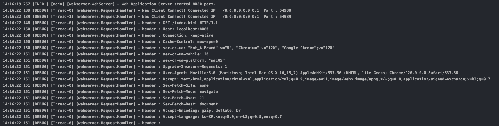
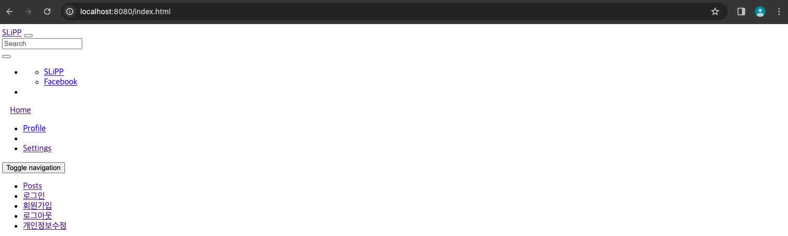
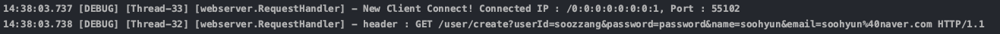
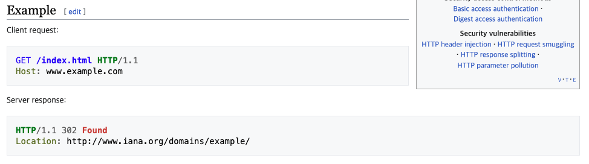
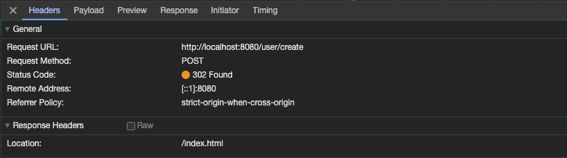
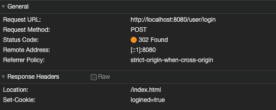
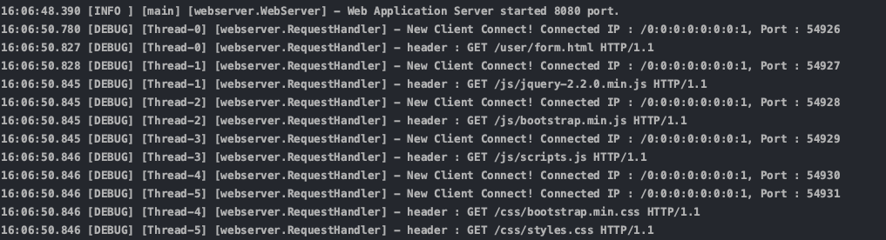
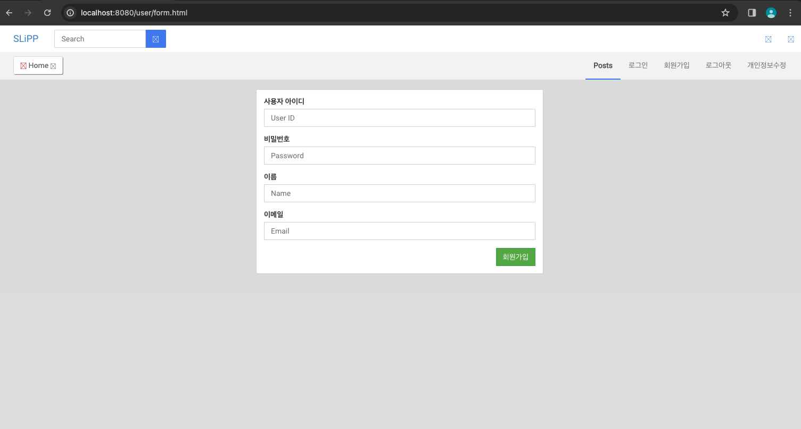

> Java를 이용하여 직접 HTTP 웹 서버 동작을 시켜보면서 내부 원리를 이해한다.

## 기본 설정

작업의 기본 설정은 아래와 같다.

```java
public class RequestHandler extends Thread {
    private static final Logger log = LoggerFactory.getLogger(RequestHandler.class);

    private Socket connection;

    public RequestHandler(Socket connectionSocket) {
        this.connection = connectionSocket;
    }

    public void run() {
        log.debug("New Client Connect! Connected IP : {}, Port : {}", connection.getInetAddress(),
                connection.getPort());

        try (InputStream in = connection.getInputStream(); OutputStream out = connection.getOutputStream()) {
            InputStreamReader reader = new InputStreamReader(in);
            BufferedReader br = new BufferedReader(reader);
            DataOutputStream dos = new DataOutputStream(out);
```

`InputStream`과 `OutputStream` 으로 바이트 단위의 입출력을 처리해 변수에 담는다.       
그 후,  `InputStreamReader`로 `InputStream`을 문자단위(character) 데이터로 변환시켜 변수에 담고, 그 변수를 `BufferdReader`를 이용해 문자열처럼 다룰 수 있도록 세팅하였다.     
     
그리고 나중에 데이터 출력에 쓰일 `DataOutputStream`타입의 변수를 선언한다.

## 'index.html' Response하기

> `http://localhost:8080/index.html`로 접속했을 때 `webapp/index.html` 파일을 읽어 클라이언트에 응답한다.

일단, 요청헤더의 전문을 `log`로 보기 위해 `BufferdReader`를 이용해 각 줄을 로그에 찍어주었다.
```java
String line = br.readLine();

while(!line.isEmpty()){
    line = br.readLine();
    log.debug("header : {}", line);
}
```


위의 로그의 두 번째와 세 번째 라인에 `Thread-0`과 `Thread-1`이 생성된 걸 볼 수 있는데, 이는 서버가 각 요청에 대해 순차적으로 실행하는 것이 아니라 동시에 각 요청의 스레드를 생성해 동시에 실행하는 것을 알 수 있다.    
     
그리고, 네 번째줄에는 앞으로 계속 사용할 `요청 라인`을 볼 수 있다. 요청 라인은 `[HTTP메소드] [URI] [버전]`으로 구성되어 있다.    

     
이제 index.html을 클라이언트에 읽어 보여주자.    
```java
String[] tokens = line.split(" ");
String url = tokens[1];

byte[] body = Files.readAllBytes(new File("./webapp" + url).toPath());
response200Header(dos, body.length);
responseBody(dos, body);
```
String[] 타입의 변수에 요청 라인을 " " 기준으로 split하여 담고, 1 번째 index에 해당하는 값(url)을 `readAllBytes`를 사용해 아래 메서드들로 클라이언트에게 해당 url에 해당하는 html을 보여준다.      
    
코드의 아래 두 줄에 쓰인 메서드들은 아래와 같다.
```java
private void response200Header(DataOutputStream dos, int lengthOfBodyContent) {
  try {
      dos.writeBytes("HTTP/1.1 200 OK \r\n");
      dos.writeBytes("Content-Type: text/html;charset=utf-8\r\n");
      dos.writeBytes("Content-Length: " + lengthOfBodyContent + "\r\n");
      dos.writeBytes("\r\n");
  } catch (IOException e) {
      log.error(e.getMessage());
  }
}

private void responseBody(DataOutputStream dos, byte[] body) {
  try {
      dos.write(body, 0, body.length);
      dos.flush();
  } catch (IOException e) {
      log.error(e.getMessage());
  }
}
```
그렇게, 아래와 같이 index.html을 클라이언트에게 보여줄 수 있었다.



## GET 방식으로 회원가입하기

> `index.html`의 `회원가입`메뉴를 클릭하면 `http://localhost:8080/user/form.html`로 이동하여 회원가입할 수 있다. 회원가입을 하면 아래와 같이 사용자의 입력값이 서버에 전달된다. <br><br>
> `/user/create?userId=soozzang&password=password&name=soohyun&email=soohyun%naver.com`

요청 메시지를 로그에 찍어보자.

위 요청 라인을 `매개변수1=값1`단위로 split 하여 DB에 넣어주면 회원가입을 할 수 있다.       
글의 길이상, split하는 과정은 생략하도록 하겠다.
```java
if(url.startsWith("/user/create")) {
    // 매개변수1=값1 단위로 split
    // String queryString = 요청 메시지의 ?뒤부터 공백전까지
    Map<String, String> params = HttpRequestUtils.parseQueryString(queryString);
    
    User user = new User(params.get("userId"), params.get("password"), params.get("name"), params.get("email"));

    log.debug("User : {}", user);
}
```
위는, 요청 메시지를 파싱하여, User모델에 회원가입의 요구 값들을 넣어 새로운 User객체를 만드는 과정이다.
    
User 모델과 그에 관련된 로직들은 아래와 같다.
```java
public class User {
    private String userId;
    private String password;
    private String name;
    private String email;

    public User(String userId, String password, String name, String email) {
        this.userId = userId;
        this.password = password;
        this.name = name;
        this.email = email;
    }
}
```
```java
public class DataBase {
    private static Map<String, User> users = Maps.newHashMap();

    public static void addUser(User user) {
        users.put(user.getUserId(), user);
    }

    public static User findUserById(String userId) {
        return users.get(userId);
    }

    public static Collection<User> findAll() {
        return users.values();
    }
}
```

이제 아래와 같이 로그에 회원을 찍어보았더니 잘 찍히는 것을 볼 수 있다!


## POST 방식으로 회원가입하기
> GET에서 POST로 방식을 바꿔보자.

GET 방식으로 요청할 때 요청 URI에 있던 쿼리 스트링이 없어지고 해당 쿼리스트링은 POST방식에선 요청 본문(body)을 통해 전달된다.

따라서 본문에 해당하는 쿼리스트링을 아까와 같이 파싱해서 DB에 넣어주면 된다!     
파싱하는 과정은 생략한다.

```java
if(url.equals("/user/create")) {
    // Map<String,String> body = 바디를 파싱하여 Map에 담음
    Map<String, String> body = HttpRequestUtils.parseQueryString(queryString);
    User user = new User(params.get("userId"), params.get("password"), params.get("name"), params.get("email"));

    log.debug("User : {}", user);

}
```

이번에도 동일하게 회원가입이 완료된 것을 확인할 수 있다.

## 302 status code 적용
> 회원가입을 "완료"하면 /index.html로 redirect 한다.

회원가입을 완료한 직후엔 클라이언트에게 전달할 파일이 없기 때문에 index.html로 redirection시키기 위해선 어떻게 할까?

구글링을 해본결과, 특정 요청에 따른 302 status의 응답헤더 구조는 아래와 같다고 한다.



위와 같이 보낸 응답을 클라이언트가 첫 줄을 읽고 302라면 `Location`의 값을 읽어 서버에 재요청을 보내는 구조를 가진다.

코드로 구현해보자.
```java
private void response302Header(DataOutputStream dos, String url) {
    try {
        dos.writeBytes("HTTP/1.1 302 Found \r\n");
        dos.writeBytes("Location: "+url+" \r\n");
        dos.writeBytes("\r\n");
    } catch (IOException e) {
        log.error(e.getMessage());
    }
}

```
위와 같이 회원가입 코드아래 위 메서드를 호출하면, 200대신 302 상태코드를 바로 띄워, 회원가입 완료 후 index.html로 Redirect한다.    


이렇게 302코드가 잘 적용이 된 것을 확인할 수 있다.

## 로그인하기

> 로그인 버튼을 눌러 성공하면 /index.html로 이동하고, 실패하면 /user/login_failed.html로 이동한다.

우선, 로그인에 성공하면 로그인 상태를 유지해야 하기 때문에, 로그인이 성공할 경우 요청 헤더의 Cookie 헤더 값이 `logined=true`가 되어야 한다.
    
먼저, HTTP가 로그인과 같이 클라이언트의 행위를 기억하기 위해 `쿠키`를 지원하는 방법에 대해 알아보았다.
      
서버에서 로그인 요청을 받으면, 성공/실패 여부에 따라 응답 헤더에 Sek-Cookie로 결과 값을 저장할 수 있다.
    
클라이언트는 `응답 헤더`의 Set-Cookie가 존재할 경우 Set-Cookie의 값을 읽어 서버에 보내는 `요청 헤더`의 Cookie 헤더 값으로 다시 전송한다. 
     
즉, HTTP는 데이터를 공유할 방법이 없기 때문에 헤더를 통해 공유할 데이터를 매번 다시 전송하는 방식으로 데이터를 공유한다.

쿠키에 대한 작업코드는 아래와 같다.    
유저를 검증해 로그인하는 로직은 생략.
```java
public class RequestHandler extends Thread{
    ....
    
    if(url.equals("/user/login")){
    // boolean isValidateUser를 선언해 유저 검증 후,
    // 아래 메서드 호출
    }
    if(isValidatedUser){
        responseLogin302Header(dos); // 로그인 성공
    } else {
        response300Header(dos, "/user/login_failed.html"); // 로그인 실패
    }
}

private void responseLogin302Header(DataOutputStream dos) {
    try {
        dos.writeBytes("HTTP/1.1 302 Found \r\n");
        dos.writeBytes("Set-Cookie: logined=true \r\n");
        dos.writeBytes("Location: /index.html \r\n");
        dos.writeBytes("\r\n");
    } catch (IOException e) {
        log.error(e.getMessage());
    }
}
```
나는 `isValidatedUser`라는 boolean타입의 변수에 로그인 성공/실패 여부를 담아, 성공하면 `responseLogin302Header`를 호출하여 응답헤더의 `Set-Cookie`값을 위와 같이 `logined=true`로 설정해주었다.


위 응답헤더의 아래쪽에서 볼 수 있듯이, 로그인 성공시에 `Set-Cookie`가 `logined=true`로 설정되어 응답된 것을 볼 수 있다.

일련의 과정을 설명하자면, 
1. 클라이언트에서 /user/login 으로 아이디와 비밀번호를 입력한다.
2. 서버가 받고 로그인이 성공하였다면, Set-Cookie헤더에 값을 추가한다.
3. 클라이언트가 위의 응답을 받아, 검증이 완료된 유저라면 요청 헤더에 Cookie를 같이 넣어서 보낸다.
4. 서버는 받은 Cookie의 유무를 통해 해당 유저가 login된 회원인지 아닌지 판단하여 로직을 수행할 수 있다.

## CSS 지원하기
아래의 로그를 보면, 하나의 요청을 보내도, 여러 번의 css 및 js의 로그가 같이 찍히는 것을 볼 수 있다. 서버가 처음, 특정 URI에 대한 응답을 하면, 브라우저는 HTML내용을 분석해 css및 js, 이미지 등의 자원이 포함되어 있으면 서버에게 재요청을 하기 때문이다.


그런데 왜 html뼈대만 클라이언트에게 보여지는걸까?      
    
문제는 모든 응답을 text/html로 보내고 있었기 때문이다. 브라우저는 응답을 받은 후 `Content-Type`헤더 값을 통해 응답 본문에 포함되어 있는 컨텐츠가 어떤 컨텐츠인지 판단하기 때문에 `Content-Type`을 `text/css`로 응답을 보내면 문제를 해결할 수 있다.

```java
public void run() {
    ...

    if(url.endsWith(".css")) {
        byte[] body = Files.readAllBytes(new File("./webapp"+url).toPath());
        response200CssHeader(dos,body.length);
        responseBody(dos,body);
    }
}

public void response200CssHeader(DataOutputStream dos, int lengthOfBodyContent) {
    try {
        dos.writeBytes("HTTP/1.1 200 OK \r\n");
        dos.writeBytes("Content-Type: text/css;charset=utf-8\r\n");
        dos.writeBytes("Content-Length: " + lengthOfBodyContent + "\r\n");
        dos.writeBytes("\r\n");
    } catch (IOException e) {
        log.error(e.getMessage());
    }
}
```

위 처럼, CSS요청에 대한 Content-Type 헤더 값을 `text/css`로 응답을 보내면 아래와 같이 문제를 해결할 수 있다.


