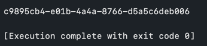

> 쿠키로만 사용자를 인증하는 방식이 아닌, 세션과 쿠키를 함께 이용한 방식에 대해 공부한다.

## 쿠키만 사용
먼저, 쿠키의 정의는 `클라이언트의 브라우저에 설치되는 작은 기록 파일`이다. 그래서, 저번 포스팅에서 HTTP를 구현하며 사용하였던 `쿠키`만을 이용했던 방식에서는 쿠키에 `클라이언트가 저장하고 싶은 정보`를 저장했다.

### 하지만 이런 쿠키만을 이용한 방식에는 단점이 존재한다.

- 보안에 취약하다. (쿠키 기록된 값을 그대로 요청으로 보내 유출 당하면 피해가 커진다.)
- 용량 제한이 있어 담을 수 있는 정보량에 한계가 존재한다.
- 웹 브라우저마다 쿠키에 대한 지원 형태가 다르기 때문에, 브라우저 간 공유가 불가능하다.

그래서 이번엔 세션을 활용한 인증 방법을 알아보도록 하겠다.

## 세션 기반 인증 방식
비밀번호, 이메일 등 클라이언트의 인증 정보를 `쿠키`가 아닌 `서버`에 저장하고 관리한다.

그럼 `서버`에 담긴 정보를 받으려면 어떻게 `인증`을 받는걸까?

세션 기반 인증 방식에선 `쿠키`안에 `세션 아이디`를 담는다. 

`서버`에 저장된 `세션`은 `세션 아이디`와 사용자의 정보를 각각 key,value값으로 가진다.

따라서, 클라이언트가 쿠키에 세션 아이디를 담아서 서버에 전달하면, 서버는 그 세션 아이디에 해당하는 세션을 찾아, 그 세션에 담긴 사용자의 정보를 제공할 수 있는 것이다.

### 세션 기반 인증 방식의 장점
- 서버가 클라리언트의 웹 브라우저에 의존하지 않아도 된다.
- 쿠키에 세션 아이디만을 넣으므로, 세션 아이디 자체는 유의미한 개인 정보를 담지 않으므로 쿠키만을 사용한 인증 방식에 비해 안전하다.
- 각 사용자마다 고유한 세션 아이디를 발급받기 때문에, 요청이 들어올 때마다 로그인(검증)할 필요가 없다.

### 세션 기반 인증 방식의 단점
- 세션 아이디가 탈취되어도 해커가 클라이언트인 척 위장하고 악의적인 요청을 보낼 수 있다.
- 서버에 정보를 저장하기 때문에 요청이 많아지면 서버에 부하가 생긴다.

요즘엔 토큰을 사용한 인증 방식을 채택 하는 추세 이지만, 쿠키와 세션에 대한 제대로 된 이해 또한 필요 하다고 생각 한다.


## 세션 구현
세션을 통한 인증 기법을 이해하기 위함 이므로 자세한 코드 설명은 생략 하도록 하겠다.

### 고유한 세션 아이디 생성
먼저 세션에서 사용할 고유 아이디(세션 아이디)를 어떻게 생성할 것인지 생각하자. JDK에선 UUID 클래스를 활용해 랜덤한 값을 제공받을 수 있다.
```java
public void printUUID {
    System.out.println(UUID.randomUUID());
}
```

위와 같이 랜덤한 값을 출력하는 것을 확인할 수 있다.

### 쿠키를 이용해 세션 아이디 전달
세션 기반 인증 방식에선 쿠키에 세션 아이디를 담아 전달한다고 했다. 쿠키에 세션 아이디를 담아보자. 
> 자바 진영에서는 세션 아이디를 전달하는 이름으로 JSESSIONID를 사용한다.

```java
public void run() {
    ...
    if(getSessionId(request.getHeader("Cookie"))==null){
        response.addHeader("Set-Cookie", "JSESSIONID=" + UUID.randomUUID());
    }
}
```

위는 요청 헤더에 Cookie 라는 key에 해당하는 value 값이 없다면, 응답으로 Set-Cookie 의 key를 가진 새로운 세션 아이디를 클라이언트에게 주는 과정이다.


> 클라이언트와 서버가 쿠키를 주고 받을 때, 요청 헤더는 `Cookie: [값]` 형태, 응답 헤더는 `Set-Cookie: [값]` 형태를 가진다.

### 모든 클라이언트의 세션을 보관하는 보관소 추가
서버에서 세션 아이디를 통해 특정 세션을 가져올 수 있는 보관소(HttpSessions)클래스를 만들어보자.

```java
@Getter
public class HttpSessions {
    private static Map<String, HttpSessoin> sessions = new HashMap<String, HttpSession>();

    public static HttpSession getSession(String id) {
        HttpSession session = sessions.get(id);

        if (session == null) {
            session = new HttpSession(id);
            sessions.put(id, session);
            return session;
        }
        return session;
    }
}
```
위의 HttpSessions란 세션 보관소는, 세션 아이디와 그 아이디에 해당하는 세션을 각각 key, value값으로 갖고 있다.

그래서, getSession()라는 메서드에서 세션 아이디를 인자로 받아, 해당 아이디에 해당하는 세션이 없다면, 새로운 세션을 만들어 아래서 만들 HttpSession이라는 세션 객체에 추가하고, HttpSessions에도 추가한 후, 해당 세션을 리턴한다.

### 클라이언트별 세션 클래스 추가
이제 세션 객체를 생성하자.
```java
@Getter
public class HttpSession {
    private Map<String, Object> values = new HashMap<String, Object>();
    
    private String id;

    public HttpSession(String id) {
        this.id = id;
    }

    public void setAttribute(String name, Object value) {
        values.put(name, value);
    }

    public Object getAttribute(String name) {
        return values.get(name);
    }
    
}
```
위의 HttpSession이라는 세션 객체는 values라는 Map 타입의 인스턴스와, String 타입의 세션 아이디가 들어갈 id라는 인스턴스를 가진다.

HttpSession은 해시맵 자료구조에 예를 들면  "user", user 와 같이 특정 오브젝트에 대한 이름과 오브젝트를 key, value값으로 가진다.


### 세션을 활용한 로그인
그래서 아래와 같이 서버는 받아, 로그인의 기능을 구현할 수 있다. 
```java
public class LoginController {
    public void Login(HttpRequest request, HttpResponse response) {
        User user = DB.findUserById(request.getParameter("userId"));

        if (user != null) {
            if (user.login(request.getParameter("password"))) { // 로그인 성공 시
                HttpSession session = request.getSession();
                session.setAttribute("user", user); // 세션에 저장
                // 로그인 후 작업
            } else {
                // 로그인 실패 시 작업
            }
        } else {
            // 로그인 실패 시 작업
        }
    }
}
public class HttpRequest {
    ...
    public HttpSession getSession() {
        // HttpSessions에서 요청의 쿠키에서 JSESSIONID와 함께 전달받은 세션 아이디를 통해 HttpSession을 꺼낸다.
        return HttpSessions.getSession(getCookies().getCookie("JSESSIONID"));
    }
}
```

위에서 로그인에 성공했을 시, getSession()을 통해 세션을 찾아서, setAttribute()를 통해 HttpSession의 인스턴스인 Map 타입의 values에 해당 유저의 정보를 key,value값으로 넣는다.

### 세션을 활용한 로그인 유무 판단
위에서 user의 정보와 세션 아이디를 가진 HttpSession객체가 HttpSessions라는 세션 보관소에 저장되었다.

이제 아래와 같이 요청 헤더에 담긴 세션 아이디를 통해 특정 세션아이디를 가진 세션 객체가 존재하는 지 확인함 으로써 로그인 유무를 판단할 수 있다.

```java
public class UserController {
    public void ifLogined(HttpRequest request, HttpResponse response) {
        if (!isLogined(request.getSession())) {
            // 로그인 유지 안 되었을 시 로직 수행
        }
        // 로그인 유지 되어 있을 때의 로직 수행
    }

    public boolean isLogined(HttpSession session) {
        Object user = session.getAttribute("user");
        if (user == null) {
            return false;
        }
        return true;
    }
}
```

위 코드에서, isLogined() 라는 메서드에 getSession()을 통해 받은 `특정 세션 아이디의 세션(HttpSession)`을 인자로 전달해, 세션(HttpSession)의 메서드인 getAttribute()로 `세션 보관소(HttpSessions)에 해당 세션(HttpSession)이 존재하는 지` 확인하고 boolean값을 리턴한다.


## 마무리
구현을 하면서 다시한 번 느낀 것은 세션을 활용한 인증방식을 채택하면 클라이언트와 서버 사이에서 상태 공유를 위해 전달하는 데이터는 `세션 아이디`뿐 이므로 세션 아이디를 예측하기 힘들게 만들어야 한다는 것이다.
