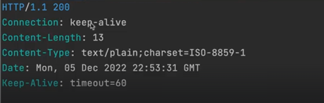

이제 스프링 컨테이너를 도입하여 어떻게 서블릿 컨테이너의 내용을 신경쓰지 않고 개발을 하게 되는지 코드를 통해 알아보고자 한다.

지금 까지 사용하던 `Hello Controller`를 `스프링 컨테이너` 안에 넣을 것이다.

스프링 컨테이너는 비즈니스 로직을 담고 있는 오브젝트인 POJO라고 하는 평범한 자바 오브젝트(지금까지 우리가 만든)와 이렇게 만들어진 코드들을 어떻게 구성할지에 대한 구성정보를 담고 있는 Configuration 데이터를 담고 있는 정보. 두 가지가 필요하다.

코드로 만들어보자.

## 스프링 컨테이너 도입

> 이제 `HelloController`를 직접 가져와서 사용하는게 아닌, `Spring Container`에 요청을 해서 가져와 사용하는 방식으로 전환할 것이다.

우선 간단한 리펙토링을 한다.

```java
public class HellobootApplication {

    public static void main(String[] args) {
        GenericApplicationContext applicationContext = new GenericApplicationContext();
        applicationContext.registerBean(HelloController.class); // 어떤 클래스로 빈을 만들 것인가
        applicationContext.refresh(); // 초기화
        
        TomcatServletWebServerFactory serverFactory = new TomcatServletWebServerFactory();
        WebServer webServer = serverFactory.getWebServer(ServletContext -> {

            servletContext.addServlet("frontcontroller", new HttpServlet() {
                @Override
                protected void service(HttpServletRequest req, HttpServletResponse resp) throws ServletException, IOException {
                    // 인증, 보안, 다국어, 공통 기능 처리 (프론트 컨트롤러)
                    if (req.getRequestURI().equals("/hello")) { // "/hello"에 대한 매핑
                        String name = req.getParameter("name");

                        HelloController helloController = applicationContext.getBean(HelloController.class); // 스프링 컨테이너에서 helloController 가져옴
                        String ret = helloController.hello(name); // 컨트롤러의 메서드 호출

                        resp.setContentType(MediaType.TEXT_PLAIN_VALUE);
                        resp.getWriter().println(ret); // 컨트롤러의 리턴값을 응답에 사용
                    } else { // 404
                        resp.setStatus(HttpStatus.NOT_FOUND.value());
                    }

                }
            }).addMapping("/*"); // 프론트 컨트롤러는 중앙에서 모든 매핑을 받아야 함.
        });
        webServer.start();
    }
}
```

이제 HelloController를 직접 가져오는게 아닌, SpringContainer의 Bean에 등록을 해준 후 가져오고 있다.
이전과 같이 잘 동작하는지 실행해보자.
    


이전과 같이 필요한 요소들이 잘 응답되는 것을 볼 수 있다.

## 의존 오브젝트 추가
스프링컨테이너는 빈으로 등록된 하나의 오브젝트를 필요할 때 마다 생성하는 것이 아닌 초기에 단 한번 생성한다.
이 처럼 애플리케이션에서 딱 하나의 오브젝트만 만들어두고 이를 재사용하는 방식을 싱글톤 패턴이라고 얘기한다.
따라서, 스프링컨테이너는 싱글톤 패턴을 따른다.

이제 `SimpleHelloService` 오브젝트를 추가해보겠다.

```java
public class SimpleHelloService {
    String sayHello(String name) {
        return "Hello " + name;
    }
}
```

이제 원래 HelloController에서 작업하던 내용을 SimpleHelloService에 위임했으니 HelloController도 수정해주겠다.

```java
public class HelloController {
    public String hello(String name) {
        SimpleHelloService helloService = new SimpleHelloService();
        
        return helloService.sayHello(Objects.requireNonNull(name)); // null 이면 exception
    }
}
```

이제 HelloController는 클라이언트가 보낸 요청에 문제가 있는지만 체크하는 정도의 역할만 맡고있고, 핵심 로직은 SimpleHelloService에 위임하고 있다.

## Dependency Injection
현재는 HelloController 가 SimpleHelloService를 의존하고 있다. 이 말은, SimpleHelloService가 변하면 HelloController가 영향을 받는다는 말과 일치한다.

이렇게 HelloController가 다른 클래스의 기능을 사용하게 되면, HelloController는 다른 클래스에 의존하고 있다고 말할 수 있다.

만약 ComplexHelloService라는 다른 클래스를 추가했다고 가정하자. 이제 HelloController가 SimpleHelloService가 아닌 ComplexHelloService를 쓰고 싶다면, HelloController의 코드를 고쳐야 한다.

이렇게 의존관계가 있으면 변경이 일어날 때마다, 코드를 고쳐야 하는 부담이 생긴다.
이런 문제를 해결하기 위해 자바에서 많이 쓰이는 소프트웨어 원칙이 있는데, 바로 `HelloService`라는 인터페이스를 추가하여 SimpleHelloService와 ComplexHelloService를 이 인터페이스를 구현한 클래스로 만드는 것이다.

이렇게 구현해두면, HelloController는, HelloService를 구현한 클래스를 아무리 많이 만들어도, 특정 클래스에 의존하고 있지 않기에 코드를 고치지 않아도 괜찮다.

여기서 끝나는게 아니다. 소스코드 레벨에서 의존하고 있는 것 같지 않더라도 실제로 런타임이 되면 HelloController는 HellocService인터페이스를 구현한 어떠한 클래스의 오브젝트를 이용해야 한다.

그때는, HelloController는 내가 어떤 클래스의 오브젝트를 사용할 지 결정이 되어 있어야 한다.
이번엔 SimpleHelloService를 이용하기로 결정했다고 가정하자. 그러면 HelloController는 인터페이스만 이용하기 때문에 지금 사용하는 클래스가 어떤 클래스인지 알 수 없다.

그래서 어떻게든 이 둘 사이에 연관관계를 만들어 주어야 한다. 이 작업을 의존성 주입(Dependency Injection)이라 부르는 것이다.

DI에는 제 3의 존재가 필요하다. 이것을 Assembler라고 부른다.
HelloController는 HelloService를 구현한 어떠한 구현 클래스에 의존을 하는데, 소스코드 레벨에서는 의존을 하고 싶지않아서 인터페이스를 도입했다. 하지만, 런타임에 필요하다면 지금 어떤 구현 클래스를 사용하는 지를 알려줘야한다.
이를 해결하기 위해, HelloController에서 직접 new로 오브젝트를 사용하는 대신에, 외부에서 그 오브젝트를 만들어서 HelloController가 사용할 수 있게 주입을 해주는 것이다.
그 작업을 Assembler가 한다.

이 Assembler를 SpringContainer라고 부르는 것이다.
스프링 컨테이너는 우리가 정보를 주면 그것을 가지고 싱글톤 오브젝트를 만드는데, 그게 전부가 아니라 그 오브젝트를 사용할 다른 `의존 오브젝트`가 있다면, 그 오브젝트를 주입해주는 작업까지 수행한다.

그래서 HelloController가 SimpleHelloService를 사용하기로 했다면, 스프링 컨테이너가 관리하는 빈으로 등록을 하고, SimpleHelloService를 HelloController에서 사용할 수 있도록 어떤 방식을 이용해서 주입을 해주는 것이다.
'주입을 해준다'는 SimpleHelloService 오브젝트의 레퍼런스를 넘겨주는 것이다.
그럼 어디서 넘겨줄까?

여러가지 방법이 있는데, 제일 대표적이고 쉬운 방법은 HelloController를 만들때, 생성자 파라미터로 SimpleHelloService의 오브젝트를 집어 넣어주는 것이다.
나머지 방법들을 말하자면, 팩토리 메서드로 빈을 만들어 파라미터로 넘길 수 도 있고, HelloController에 setter 메서드를 정의해서 SimpleHelloService의 오브젝트를 주입해주는 방식도 있다.

그래서 스프링 컨테이너가 오브젝트를 만들고, 주입하는 등의 작업을 하며 컨테이너로서의 동작을 하는 것이다.

이제 코드로 어떻게 스프링 컨테이너가 의존성을 주입하는지 알아보자.

## 의존 오브젝트 DI 적용

현재까진 HelloController가 SimpleHelloService의 오브젝트를 직접 생성하여 사용하는 방식이었는데, 이젠 스프링 Bean으로 등록을하고, 스프링 컨테이너가 어셈블러로 SimpleHelloService의 오브젝트를 HelloController가 사용할 수 있도록 주입해주는 DI(DependencyInjection) 작업을 수행해보도록 하겠다.

이제 SimpleHelloService를 HelloService 인터페이스를 구현하는 구현체로 만들 것 이다.
```java
public class SimpleHelloService implements HelloService {
    @Override
    String sayHello(String name) {
        return "Hello " + name;
    }
}
```
 
이제 HelloController가 특정 클래스를 직접 인스턴스를 만드는 방식이 아닌, 어셈블러인 스프링 컨테이너가 HelloController의 오브젝트를 만들 때 생성자 파라미터로 주입받을 수 있는 방식으로 변경해야 한다. 

```java
public class HelloController {
    private final HelloService helloService;

    public HelloController(HelloService helloService) {
        this.helloService = helloService;
    }

    public String hello(String name) {
        return helloService.sayHello(Objects.requireNonNull(name));
    }
}
```

이제, HelloService타입의 클래스도 Bean으로 등록을 해야한다.

> 여기서 Bean으로 등록한다는 것은, 컨테이너가 그 오브젝트를 만들고 필요하면 다른 오브젝트를 만들 때 생성자 등으로 주입을 해서 의존관계를 런타임에 맺어주는 작업을 포함한다.

```java
public class HellobootApplication {

    public static void main(String[] args) {
        GenericApplicationContext applicationContext = new GenericApplicationContext();
        applicationContext.registerBean(HelloController.class); // 어떤 클래스로 빈을 만들 것인가
        applicationContext.registerBean(SimpleHelloService.class); // 어떤 클래스로 빈을 만들 것인가
        applicationContext.refresh(); // 초기화
        
        ...
}
```

> Bean을 등록할 땐, 클래스 타입을 넣어줘야 하므로 인터페이스인 HelloService가 아닌, 클래스 타입의 SimpleHelloService를 넣어준다.

그럼 스프링 컨테이너는 어떻게 SimpleHelloService Bean을 HelloController에 주입을 해주는 과정을 생각해보자.
- HelloController의 생성자에 주입해야할 파라미터가 HelloService, 인터페이스 타입인 걸 인지함.
- 스프링 컨테이너의 모든 등록정보를 다 뒤져서, HelloService 인터페이스를 구현한 클래스가 있는지 찾는다.
- 찾다보니, `applicationContext.registerBean(SimpleHelloService.class)`로 등록한 SimpleHelloService가 Bean으로 등록된 것을 찾음.
- 이것을 HelloController의 생성자에 넣어줄 수 있겠다는 것을 알게됨.
- 주입을 하며 HelloController Bean까지 만들게 됨.
- 결국 논리적 순서는 SimpleHelloService -> HelloController임.


