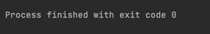
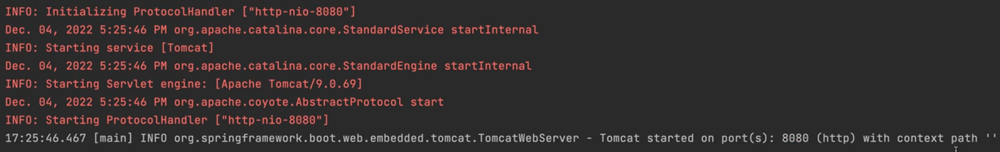
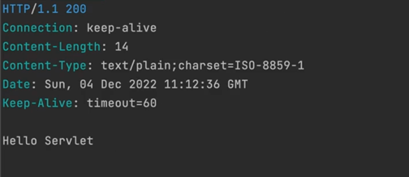
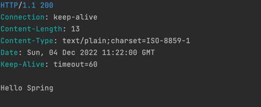

## Containerless
스프링 부트는 containerless 웹 애플리케이션 아키텍쳐를 스프링이 지원해줬으면 좋겠다는 한 개발자의 요청으로 부터 시작했다.

Containerless는 서버의 설치와 관리를 개발자가 신경쓰지 않고, 서버 애플리케이션을 배포해서 개발하고 운영하는게 가능하도록 만든다는 의미인 Serverless와 유사한 개념을 가지고 있다.

일단 스프링은 IOC "컨테이너"이다.

웹 프로그램을 개발한다는건 서버에서 동작하면서 기능을 제공하는 여러가지 컴포넌트들을 만드는 것이다.
하지만 웹 컴포넌트는 혼자서 일하지 못한다. 앞에 웹 클라이언트를 항상 필요로 한다.

웹 클라이언트가 요청을 주면 그때 웹컴포넌트가 일을 하는 구조를 갖는다.
웹 컴포넌트의 핵심적인 목적은 Dynamic Content(동적인 컨텐츠)를 만들어서 응답하는 것이다.
정리하면, 웹은 항상 요청과 응답 쌍으로 돌아가게 되어있다. 그 요청을 처리하는 하나 이상의 웹 컴포넌트가 존재하고, 그가 하는 주요한 일은 Dynamic Content를 만드는 일이다.

`웹 컴포넌트`는 혼자있을 수 없다. 항상 `웹 컨테이너` 안에 있어야 한다.
웹 컨테이너는 하나 이상의 웹 컴포넌트들을 관리한다. 또, `클라이언트로부터 들어온 요청을 어느 컴포넌트가 담당할지 결정해서 연결해주는 작업`을 해야한다.
그 작업을 흔히 `라우팅` 또는 `매핑`이라고 한다. (스프링에서는 핸들러 매핑)

자바에서는 웹 컴포넌트를 `서블릿`이라고 부른다. 그리고, 이 서블릿들을 관리해주는 컨테이너를 `서블릿 컨테이너`라고 부른다.

우리가 가장 많이 들어본 서블릿 컨테이너는 `톰캣`이 있다. 서블릿 컨테이너안에 여러 서블릿들을 띄워놓고, 매핑정보를 넣으면 요청에 따라서 특정 서블릿이 해당 요청을 처리할 수 있도록 그 응답을 클라이언트에게 돌려주는 작업을 담당한다.

여기까지가 자바 웹 프로그래밍의 가장 기본적인 구성이다.

그 후, 서블릿에 불만을 가진 사람들이 만든 것중 하나가 스프링 프레임워크이다.
스프링도 컨테이너라고 위에서 언급했는데, 스프링 컨테이너는 서블릿 컨테이너를 대체하는 것이 아니고, 서블릿 컨테이너 `뒤에` 존재하고 스프링 컨테이너 안의 컴포넌트를 `빈`이라고 부르는데, 서블릿 컨테이너 뒤쪽에서 서블릿을 통해 웹으로 들어온 요청을 받아서 스프링 컨테이너에게 넘겨주면 `스프링 컨테이너`가 `어느 빈이 이 요청을 처리할지 결정하고 역할을 위임한다.`

그럼 스프링 컨테이너가 서블릿 컨테이너를 대체하면안될까? 지금은 안된다. 기본적으로 자바의 표준 웹 기술을 사용하려면 서블릿 컨테이너가 존재해야한다.

문제는, 스프링 개발하는데만 집중하고 싶은데, 이걸 동작시키려면 서블릿 컨테이너가 무조건 작동해야하고 필요하다.

그런데 이 서블릿 컨테이너를 띄우는게 간단한 일이 아니다. 많은 설정 정보를 적고 배포해야 한다.

그래서 서블릿 컨테이너가 없는, `Containerless` 웹 아키텍쳐를 만들자 라는 얘기는, 서블릿 컨테이너가 필요하지만, 이것을 `설치하고 관리하기 위해 개발자가 시간을 들이는 수고를 제거하는 것`이다.

그래서 Containerless 아키텍쳐를 가진 스프링부트를 통해서 서블릿 컨테이너 설정을 알아서 해주고, 우리는 서블릿 컨테이너 뒤에있는 스프링 컨테이너만 건드리면 된다.

따라서 스프링 부트의 main 메서드만 실행하면 서블릿 컨테이너 관련 작업이 알아서 되는 것이다.
이것을 `독립 실행형 애플리케이션`, 또는 `StandAlone 애플리케이션`이라고 부른다.


## Empty Servlet Container 만들기

스프링부트로 설정된 `HellobootApplication`에 스프링부트관련 코드 및 애노테이션을 지우고 직접 만들어 작동시켜 보자.


```java
import org.springframework.boot.SpringApplication;
import org.springframework.boot.autocoonfigure.SpringBootApplication;

@SpringBootApplication
public class HellobootApplication {
    
    public static void main(String[] args) {
        SpringApplication.run(HellobootApplication.class, args);
    }
}
```
아래와 같이 스프링부트 관련 코드를 없애고, 스프링부트가 없다고 생각하고 시작한다.

```java
public class HellobootApplication {
    
    public static void main(String[] args) {
    }
}
```

이 상태에서 main 메서드를 실행하면 아무일이 일어나지 않는다.


우리의 관심사는 '어떻게 서블릿 컨테이너를 신경안쓰고 동작하게 만들 것인가' 이다.
Stand alone 프로그램을 만들어, 이 서블릿 컨테이너를 알아서 띄워주는 작업을 해야한다.
편의상, 서블릿 컨테이너안에는 서블릿이 단 하나만 존재한다는 상황을 갖고 시작한다.

일단 빈 서블릿 컨테이너를 코드로 띄워보는 작업을 해보자.
서블릿 컨테이너의 대명사 처럼 자주 쓰이는 것이 톰캣이다. 그래서, 톰캣을 이 main 메서드를 통해서 시작해보자.
이 톰캣을 내장에서 필요한 환경에서 사용하게 해주는 `내장형 톰캣`이라는 라이브러리를 제공한다. 프로젝트 생성 시 이미 해당 라이브러리가 들어와 있기 때문에, 그것을 불러와 시작하자.

톰캣 서블릿을 편하게 사용할 수 있게 해주는 일종의 도우미 클래스인 TomcatServletWebServerFactory를 사용한다.

```java
public class HellobootApplication {

    public static void main(String[] args) {
        TomcatServletWebServerFactory serverFactory = new TomcatServletWebServerFactory();
        WebServer webServer = serverFactory.getWebServer(); // 서블릿 컨테이너를 만드는 생성 함수
        webServer.start(); // 톰캣 서블릿 컨테이너가 동작함
    }
}
```
위를 실행시키면, 아래와 같이 톰캣이 8080포트에 띄워져 있다고 한걸 볼 수 있다!



## Servlet 등록
빈 서블릿 컨테이너를 띄우는데에 성공했으니, 이제 서블릿 컨테이너 안에 들어갈 웹 컴포넌트 하나를 넣어보자.

```java
public class HellobootApplication {

    public static void main(String[] args) {
        TomcatServletWebServerFactory serverFactory = new TomcatServletWebServerFactory();
        WebServer webServer = serverFactory.getWebServer(ServletContext -> {
            servletContext.addServlet("hello", new HttpServlet() {
                @Override
                protected void service(HttpServletRequest req, HttpServletResponse resp) throws ServletException, IOException {
                    // 웹 응답의 3가지 요소 추가
                    resp.setStatus(200); // 상태코드
                    resp.setHeader("Content-Type", "text/plain"); // 헤더 
                    resp.getWriter().println("Hello Servlet"); // 바디
                }
            }).addMapping("/hello"); // 매핑
        }); // 서블릿 컨테이너를 만드는 생성 함수
        webServer.start(); // 톰캣 서블릿 컨테이너가 동작함
    }
}
```
위 처럼 "/hello"로 들어오는 요청에 대한 응답을 처리해주었다. (서블릿에 관련한 클래스 및 메서드들의 설명은 생략한다. 흐름을 읽는게 중요)

그래서 /hello로 요청을 보내보면,

성공적으로 설정해놓은 200 응답을 보낸 것을 볼 수 있다.


## 서블릿 요청 처리

리펙토링을 해보자.

```java
public class HellobootApplication {

    public static void main(String[] args) {
        TomcatServletWebServerFactory serverFactory = new TomcatServletWebServerFactory();
        WebServer webServer = serverFactory.getWebServer(ServletContext -> {
            servletContext.addServlet("hello", new HttpServlet() {
                @Override
                protected void service(HttpServletRequest req, HttpServletResponse resp) throws ServletException, IOException {
                    // 하드 코딩x 하게 리펙토링
                    resp.setStatus(HttpStatus.OK.value()); // 상태코드
                    resp.setHeader(HttpHeaders.CONTENT_TYPE, MediaType.TEXT_PLAIN_VALUE); // 헤더 
                    resp.getWriter().println("Hello Servlet"); // 바디
                }
            }).addMapping("/hello"); // 매핑
        }); // 서블릿 컨테이너를 만드는 생성 함수
        webServer.start(); // 톰캣 서블릿 컨테이너가 동작함
    }
}
```

이제 요청에 대한 처리를 해보자. 예를 들어 쿼리스트링으로 파라미터를 받아서 이에 해당하는 동적을 응답을 하는 코드를 작성해보자. 

```java
public class HellobootApplication {

    public static void main(String[] args) {
        TomcatServletWebServerFactory serverFactory = new TomcatServletWebServerFactory();
        WebServer webServer = serverFactory.getWebServer(ServletContext -> {
            servletContext.addServlet("hello", new HttpServlet() {
                @Override
                protected void service(HttpServletRequest req, HttpServletResponse resp) throws ServletException, IOException {
                    // 요청
                    String name = req.getParameter("name");
                    
                    // 응답
                    resp.setStatus(HttpStatus.OK.value()); // 상태코드
                    resp.setHeader(HttpHeaders.CONTENT_TYPE, MediaType.TEXT_PLAIN_VALUE); // 헤더 
                    resp.getWriter().println("Hello " + name); // 바디
                }
            }).addMapping("/hello"); // 매핑
        }); // 서블릿 컨테이너를 만드는 생성 함수
        webServer.start(); // 톰캣 서블릿 컨테이너가 동작함
    }
}
```
위처럼 쿼리스트링으로 name에 대한 값을 받아서 Hello {name}의 형태로 출력하게 만들었다.
잘 작동하는지 살펴보자.

"localhost:8080/hello?name=Spring" 으로 요청을 보내면,


의도대로 name의 값인 Spring이 잘 담겨 출력되는 것을 볼 수 있다.

다음엔 `프론트 컨트롤러`를 적용해서 이어나갈 예정이다.

