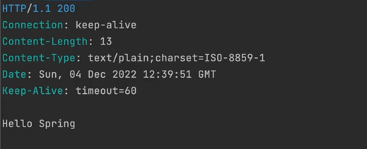
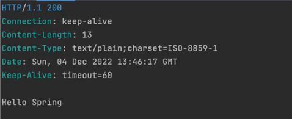

지금까지의 코드에선 서블릿은 요청마다 각각 매핑을 해줘야 했다. 
예를 들어, "/user"는 유저를 등록하는 기능을 맡는다 .. 등등

과거에는 이러한 서블릿의 구조를 개선할 필요가 있었다. 왜냐면 서블릿의 개수가 늘어나고 컨테이너로부터 직접 요청을 받아서 모든 작업을 수행하고 리턴하는 코드를 만들다 보니, 대부분의 서블릿 에서 필요로 하는 `공통적인 작업`이 각 서블릿 코드안에 중복되어서 등장하였다.

그래서 `프론트 컨트롤러`가 등장하였다.
원래는 각기 다른 서블릿이 각기 다른 url에 대한 요청을 처리하는 방식이었다면,

프론트 컨트롤러를 도입하여, 모든 서블릿에 공통적으로 들어가는 코드를 `제일 앞단에 존재하는` `프론트 컨트롤러`에서 처리하고, 이 요청을 종류에 따라서 `다른 오브젝트에게 역할을 위임`하는 방식으로 애플리케이션이 돌아가게 만들었다.

앞단에 있지만 후처리 과정에도 공통적인 코드가 있다면 그것도 해결한다.

프론트 컨트롤러가 공통적으로 처리하는 대표적인 작업들은 `인증,보안,다국어 처리` 등이 있다.

그래서 우리가 만들던 코드를 프론트 컨트롤러 형식으로 만들고자 한다.

## 프론트 컨트롤러로 전환
```java
public class HellobootApplication {

    public static void main(String[] args) {
        TomcatServletWebServerFactory serverFactory = new TomcatServletWebServerFactory();
        WebServer webServer = serverFactory.getWebServer(ServletContext -> {
            servletContext.addServlet("frontcontroller", new HttpServlet() {
                @Override
                protected void service(HttpServletRequest req, HttpServletResponse resp) throws ServletException, IOException {
                    // 인증, 보안, 다국어, 공통 기능 처리 (프론트 컨트롤러)
                    if(req.getRequestURI().equals("/hello")){ // "/hello"에 대한 매핑
                        String name = req.getParameter("name");

                        resp.setStatus(HttpStatus.OK.value());
                        resp.setHeader(HttpHeaders.CONTENT_TYPE, MediaType.TEXT_PLAIN_VALUE);
                        resp.getWriter().println("Hello " + name);
                    }
                    else if (req.getRequestURI().equals("/user")){ // "/user"에 대한 매핑
                        //
                    }
                    else { // 404
                        resp.setStatus(HttpStatus.NOT_FOUND.value());
                    }
                    
                }
            }).addMapping("/*"); // 프론트 컨트롤러는 중앙에서 모든 매핑을 받아야 함.
        }); 
        webServer.start(); 
    }
}
```
프론트 컨트롤러가 앞단에서 모든 매핑을 받도록 경로를 설정해주고, 서블릿 컨트롤러의 매핑 기능을 담당하게끔 변경했다.

이제 프론트 컨트롤러가 앞단에서 공통 기능을 처리한 후 요청에 따라 다른 경로로 매핑패준다.
"localhost:8080/hello?name=Spring"으로 요청을 보내보자.


성공적으로 응답이 나오는 것을 볼 수 있다.


## Controller 매핑 및 바인딩

프론트 컨트롤러와 우리가 만든 `HelloController`를 연결해보자.

HelloController의 코드에서 스프링부트 관련 코드를 지워보자.
```java
@RestController
public class HelloController {
    @GetMapping("/hello")
    public String hello(String name) {
        reutnr "Hello " + name;
    }
}
```
아래와 같이 제거한다.

```java
public class HelloController {
    public String hello(String name) {
        reutnr "Hello " + name;
    }
}
```

이제 프론트 컨트롤러가 위의 HelloController의 작업을 사용하도록 만들어보자.

```java
public class HellobootApplication {

    public static void main(String[] args) {
        TomcatServletWebServerFactory serverFactory = new TomcatServletWebServerFactory();
        WebServer webServer = serverFactory.getWebServer(ServletContext -> {
            HelloController helloController = new HelloController(); // HelloController를 가져온다.
            
            servletContext.addServlet("frontcontroller", new HttpServlet() {
                @Override
                protected void service(HttpServletRequest req, HttpServletResponse resp) throws ServletException, IOException {
                    // 인증, 보안, 다국어, 공통 기능 처리 (프론트 컨트롤러)
                    if(req.getRequestURI().equals("/hello")){ // "/hello"에 대한 매핑
                        String name = req.getParameter("name");
                        
                        String ret = helloController.hello(name); // 컨트롤러의 메서드 호출

                        resp.setStatus(HttpStatus.OK.value());
                        resp.setHeader(HttpHeaders.CONTENT_TYPE, MediaType.TEXT_PLAIN_VALUE);
                        resp.getWriter().println(ret); // 컨트롤러의 리턴값을 응답에 사용
                    }
                    else if (req.getRequestURI().equals("/user")){ // "/user"에 대한 매핑
                        //
                    }
                    else { // 404
                        resp.setStatus(HttpStatus.NOT_FOUND.value());
                    }
                    
                }
            }).addMapping("/*"); // 프론트 컨트롤러는 중앙에서 모든 매핑을 받아야 함.
        }); 
        webServer.start(); 
    }
}
```
이제 HelloController의 메서드를 사용하여, 해당 메서드의 리턴 값을 응답에 사용하였다.
잘 동작하는지 살펴보자.


잘 동작한다. 이번에는 프론트 컨트롤러에 작업을 위임한게 아닌, HelloController에 위임하여, 그의 메서드 안에서의 로직이 실행된 것이다.